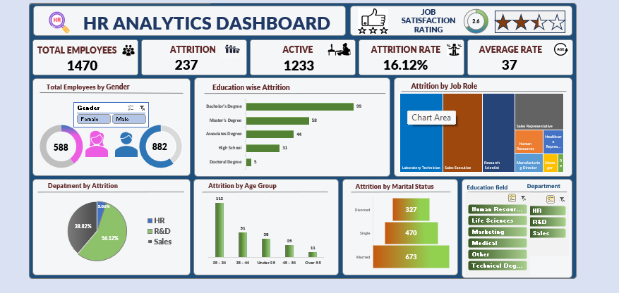

# 📊 HR Analytics Dashboard (Excel)

This project is an **HR Analytics Dashboard** created in Microsoft Excel to analyze employee data and provide meaningful insights related to **attrition, job satisfaction, and workforce demographics**.

---

## 🧾 Project Objectives
- Identify **attrition trends** across job roles, departments, and education fields  
- Monitor **employee satisfaction levels**  
- Analyze **age groups** and **marital status** patterns  
- Help HR make **data-driven decisions**

---

## 🛠 Tools Used
- Microsoft Excel  
- Pivot Tables  
- Pivot Charts  
- Data Cleaning  
- Dashboard Design  

---

## 📈 Key Insights

| Metric | Value | Meaning |
|-------|--------|---------|
| **Total Employees** | 1470 | Current workforce |
| **Attrition** | 237 | Employees who left |
| **Attrition Rate** | 16.12% | Overall turnover rate |
| **Average Age** | 37 | Workforce age level |
| **Satisfaction Score** | 2.6 / 5 | Medium satisfaction |

### 🔍 Additional Findings
- Maximum attrition in **Sales** department  
- Highest attrition among **Bachelor’s Degree** holders  
- **26–35 age group** shows the biggest exit rate  
- Married employees show **better retention**

---

---

## 🚀 How to Use
1. Download the Excel file: **HR_Analytics_Dashboard.xlsx**  
2. Open in Microsoft Excel  
3. Explore dashboard using slicers:  
   - Gender  
   - Department  
   - Education Field  

---

## 👤 Author
**Zishan Alam**  
🎓 MCA Graduate | 📊 Data Analyst  
💡 Skills: Excel, SQL, Power BI  
📬 LinkedIn: 

---

## 🌟 Highlights
- Clean and interactive dashboard  
- HR-focused insights  
- Recruiter-friendly project  
